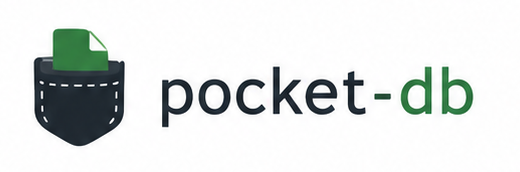

<p align="center">
  
</p>

<p align="center">
  An embedded, single-file NoSQL database for Node.js — simple to set up, zero production dependencies.
</p>

<p align="center">
  <a href="https://www.npmjs.com/package/@axfab/pocket-db"></a>
  <a href="LICENSE"></a>
  
  <a href="https://npmcharts.com/compare/@axfab/pocket-db?minimal=true"></a>
</p>

---

Pocket DB stores everything in a **single append-only file** — no server, no daemon, no setup. You open a file, work with collections of JSON documents, and close. That is the whole model.

- ✓ Single file
- ✓ Mongo-like API
- ✓ Zero runtime dependencies
- ✓ Fast append-only writes

It is inspired by SQLite (one file, embedded) and MongoDB (document model, familiar API), but intentionally small. The core constraint — *never reserialise the entire database on a write* — means every insert, update and delete is a fast append. Reading a document means seeking to its offset and reading only those bytes.

Good fit for: desktop apps, CLI tools, Electron apps, local servers, plugins, structured caches, offline-first prototypes.

Not a fit for: multi-process concurrent writers, datasets requiring complex aggregation pipelines, or anything that would normally call for a full server database.

---

## Install

```bash
npm install @axfab/pocket-db
```

No native binaries. No optional dependencies. Pure TypeScript compiled to ESM.

---

## Quick start

```ts
import { pocketDb } from "pocket-db";

const db = pocketDb("./data.pdb");
const users = db.collection("users");

// Insert
const { insertedId } = users.insertOne({ name: "Ada", role: "admin", age: 37 });

// Find
const ada = users.findOne({ name: "Ada" });
console.log(ada); // { _id: "...", name: "Ada", role: "admin", age: 37 }

// Query with operators
const admins = users.find({ role: "admin", age: { $gte: 18 } }).toArray();

// Update
users.updateOne(insertedId, { $set: { age: 38 }, $inc: { loginCount: 1 } });

// Delete
users.deleteOne(insertedId);

db.close();
```

---

## Core concepts

### Single file, append-only

All writes are appended to the end of the file. Reads go directly to the byte offset of the document — no full-file scan. The in-memory state is rebuilt by replaying the log when `open()` is called. Deleted and updated documents leave dead records behind; `db.compact()` reclaims that space in a single forward pass.

### Collections

A database holds any number of named collections. Collections are created implicitly on first access and persisted to the log. Each collection has its own primary index (keyed by `_id`) and optional secondary indexes.

### Document IDs

Every document gets a `_id`: a 24-character lowercase hex string (12-byte ObjectId layout — 4-byte timestamp, 5-byte random, 3-byte counter). You can supply your own `_id` on insert as long as it matches that format.

---

## API

### Opening a database

```ts
import { pocketDb } from "pocket-db";
const db = pocketDb("./data.pdb");
```

You can also merge both arguments by setting the `path` property in the options object, or pass all options together:

```ts
const db = pocketDb({ path: "./data.pdb" });
```

`pocketDb` accepts an optional `OpenOptions` object as its second argument (or first, when using the object form):

```ts
const db = pocketDb("./data.pdb", {
  durability: "strict",      // default: "relaxed"
  serialization: "bson",     // default: "json" — only applies when creating a new file
});
```

#### `durability`

Controls whether `fsync` is called after every write.

- `"relaxed"` *(default)* — skips `fsync`. Writes reach the OS page cache but may be lost on a power failure or OS crash before the cache is flushed. Faster; suitable when losing the last few writes on a hard crash is acceptable.
- `"strict"` — calls `fsync` after every `appendOperation`, guaranteeing data is on durable storage before the call returns. Safest; incurs one extra syscall per write.

#### `serialization`

Selects the document encoding format when **creating a new database file**. Opening an existing file always uses the format recorded in the file header — this option is ignored.

- `"json"` *(default)* — documents stored as UTF-8 JSON. Human-readable, universally compatible.
- `"bson"` — documents stored as BSON (Binary JSON). Supports double, string, document, array, boolean, null, int32, int64. More compact than JSON for numeric-heavy documents.
- `"amf3"` — documents stored as AMF3 (Action Message Format 3). A compact binary format supporting undefined, null, boolean, integer, double, string, array, and object.

### Database

```ts
db.collection(name: string): Collection
db.getCollections(): string[]              // names of all registered collections
db.existsCollection(name: string): boolean
db.compact(): void                         // reclaim space from dead records
db.close(): void
```

### Collection

```ts
collection.insertOne(doc): InsertOneResult
collection.insertMany(docs): InsertManyResult

collection.findOne(query?): Record | null
collection.find(query?): Cursor
collection.countDocuments(query?): number

collection.updateOne(id | query, update): UpdateResult
collection.updateMany(query, update): UpdateResult

collection.replaceOne(id, doc): ReplaceOneResult
collection.replaceOne(doc & { _id }): ReplaceOneResult

collection.deleteOne(id | query): DeleteOneResult
collection.deleteMany(query?): DeleteManyResult

collection.createIndex(field, { type: "string" | "number" }): CreateIndexResult
collection.dropIndex(field): DropIndexResult
collection.getIndexes(): { name: string; type: string }[]
collection.existsIndex(name: string): boolean
collection.drop(): DropResult
```

### Cursor

```ts
cursor.next(): Record | null
cursor.toArray(): Record[]
cursor.count(): number

cursor.sort(spec: Record<string, 1 | -1>): Cursor   // up to 4 fields
cursor.limit(n: number): Cursor
cursor.skip(n: number): Cursor
```

---

## Query operators

Queries are plain objects. A bare value is shorthand for `$eq`.

| Operator | Description |
|----------|-------------|
| `$eq` | Strict equality (no type coercion) |
| `$ne` | Not equal |
| `$gt` / `$gte` | Greater than / greater than or equal |
| `$lt` / `$lte` | Less than / less than or equal |
| `$in` | Field value is in the given array |
| `$nin` | Field value is not in the given array |
| `$exists` | Field is present (`true`) or absent (`false`) |
| `$not` | Negates an operator expression |
| `$and` | Logical AND of sub-queries |
| `$or` | Logical OR of sub-queries |
| `$nor` | Logical NOR of sub-queries |

```ts
// Compound query
users.find({
  $and: [
    { role: { $in: ["admin", "editor"] } },
    { age: { $gte: 18, $lt: 65 } }
  ]
});

// Negation
users.find({ status: { $not: { $eq: "banned" } } });

// OR
users.find({ $or: [{ role: "admin" }, { role: "editor" }] });
```

---

## Update operators

Updates are expressed as operator objects applied to the current document.

| Operator | Description |
|----------|-------------|
| `$set` | Set one or more fields |
| `$unset` | Remove one or more fields |
| `$inc` | Increment a numeric field |
| `$min` / `$max` | Set field only if new value is lower / higher |
| `$push` | Append a value to an array field |

```ts
users.updateOne(id, {
  $set: { role: "editor" },
  $inc: { loginCount: 1 }
});
```

`_id` is immutable and cannot be modified by any update operator.

---

## Indexes

Secondary indexes speed up equality and range queries. They are rebuilt from the log at every open.

```ts
// Create
users.createIndex("role", { type: "string" });
users.createIndex("age",  { type: "number" });

// Drop
users.dropIndex("role");
```

`StringIndex` supports `$eq` and `$in` lookups. `NumberIndex` additionally supports `$gt`, `$gte`, `$lt`, `$lte` range scans. The query planner automatically picks the most selective available index for each query.

---

## Sorting and pagination

```ts
const page = users
  .find({ role: "admin" })
  .sort({ age: -1, name: 1 })   // up to 4 sort fields
  .skip(20)
  .limit(10)
  .toArray();
```

Sort accepts `1` (ascending) and `-1` (descending). Missing values sort **first** in ascending order and **last** in descending order. Sorting is always eager — narrow the candidate set with an indexed query before sorting over large collections.

---

## Compaction

Dead records accumulate as documents are updated or deleted. `compact()` rewrites the file in a single forward pass, keeping only live data:

```ts
db.compact();
```

After compaction, all in-memory indexes are refreshed automatically.

---

## Batch atomicity

`insertMany`, `updateMany`, and `deleteMany` are crash-safe: if the process is killed mid-batch, the partial batch is silently discarded on the next open. Either all operations are visible or none are.

---

## File locking

`open()` creates a `.lock` file next to the database file. A second `open()` on the same path from a different process will throw. Stale locks left by crashed processes are detected via PID check and cleared automatically.

Pocket DB is designed for **single-process use**. Multiple concurrent writers on the same file are not supported.

---

## TypeScript

Pocket DB is written in TypeScript and ships its own type declarations. All public types are exported from the package root:

```ts
import { open, pocketDb } from "pocket-db";
import type {
  Database, Collection, Cursor,
  InsertOneResult, InsertManyResult,
  UpdateResult, ReplaceOneResult,
  DeleteOneResult, DeleteManyResult,
  CreateIndexResult, DropIndexResult, DropResult,
  IndexInfo, OpenOptions, SortDirection
} from "pocket-db";
```

---

## Documentation

The `docs/` folder contains in-depth documentation available as a wiki:

- [File format](docs/file-format.md) — binary layout, record structure, U29 encoding
- [Storage semantics](docs/storage.md) — replay rules, write path, crash recovery
- [Query & update model](docs/query.md) — operators, compilation, cursor semantics
- [Indexes](docs/indexes.md) — primary index, StringIndex, NumberIndex, query planner
- [Compaction](docs/compact.md) — algorithm, invariants, secondary index refresh

---

## Performance

Pocket DB is benchmarked against several alternative embedded stores on a collection of 1,000 documents across ten common operations. The numbers below are ops/sec on an Apple M-series machine — higher is better. An asterisk marks the fastest adapter for each operation.

```
Benchmark results — 1,000 documents
────────────────────────────────────────────────────────────────────────────────────────────────────────────────────────────────────
Operation                        pocket-db   sqlite (memory)     sqlite (file)         json-file             lowdb            lokijs
────────────────────────────────────────────────────────────────────────────────────────────────────────────────────────────────────
insertOne                        198,177           226,278 *           4,421             3,893             2,256             1,004
insertMany (100)                   2,345             2,963 *             402               788               628               264
findById                         142,776         1,064,774           248,942        12,532,585 *         321,548         4,061,606
findAll                               96               361               361           115,774           870,822 *           1,179
findByName (scan)                     97               536               524            19,579            24,235 *           8,222
findByRole (index)                   277               884               887            18,527            21,796 *           3,215
updateOne                         97,889           423,072 *           2,675               784               566               188
deleteOne                        454,402           465,026 *           5,551               924               663               220
countAll                          12,038         2,233,389           285,285        42,553,191 *      34,914,251        37,348,273
sortByScore (desc)                    91               293               293             4,947             5,099 *           1,123
────────────────────────────────────────────────────────────────────────────────────────────────────────────────────────────────────
All values in ops/sec.  * = fastest for this operation.
```

**What these numbers reveal:**

The append-only log design is the reason pocket-db's write throughput is competitive with SQLite in-memory for inserts and faster than everything else for deletes and single-document updates. Every mutation is a single sequential write — there is no B-tree rebalancing, no page allocation, and no full-file reserialisation. `deleteOne` and `updateOne` are particularly cheap because they only append a tombstone or a replacement record and update the in-memory index pointer.

Reads are a different story. Unlike json-file, lowdb, or LokiJS — which serve reads entirely from in-memory structures — pocket-db currently has no document cache. Every `findOne` and every cursor step seeks to the document's file offset and reads from disk. This explains why in-memory adapters show several orders of magnitude higher read throughput. A read cache is planned for V2 and will reach to close this gap for hot-document workloads without changing the write model.

In short: if your workload is write-heavy or you need durability on every write, pocket-db competes well. If you need high-throughput in-memory reads and can afford to lose data on crash, a pure in-memory store will outperform it today.

Run the benchmarks yourself:

```bash
npm install
npm run bench
```

---

## License

[MIT](LICENSE) © Fabien Bavent
